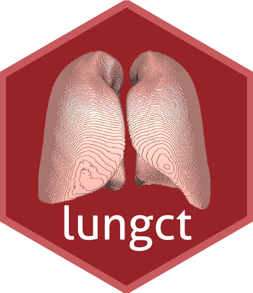
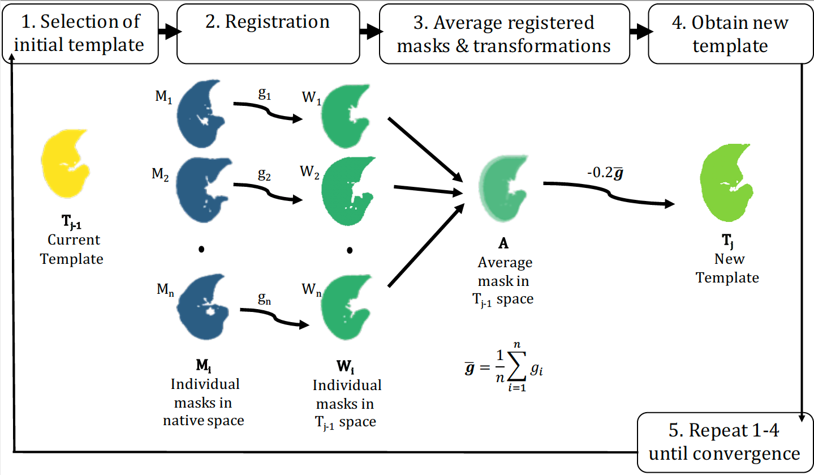

<!-- README.md is generated from README.Rmd. Please edit that file -->

```{r setup, include = FALSE}
knitr::opts_chunk$set(
  collapse = TRUE,
  comment = "#>",
  fig.path = "man/figures/README-",
  out.width = "100%"
)
```
# lungct


[](https://travis-ci.org/muschellij2/lungct)


The lungct R package develops an image processing pipeline for computed tomography (CT) scans of the lungs. 




## Highlights

* We develop a free and simple segmentation algorithm that is comparable to the proprietary VIDA Diagnostics software

* We create the first publicly available standard lung template using healthy adults, which is available for download via lungct

* We show that the standard lung template allows for improved population-level inference of lung CTs using radiomics

* lungct provides a fully-automated and open-source image processing pipeline for lung CTs, which is accessible to statisticians

## Installation

You can install lungct from github with:

``` r
# install.packages("devtools")
devtools::install_github("muschellij2/lungct")
```


## Segmentation

To segment the lungs from the CT scan: 

``` r
library(lungct)
filename <- "example.nii.gz"
mask <- segment_lung(filename)
```

To segment the left and right lungs from the CT scan: 

``` r
img <- ANTsRCore::antsImageRead(filename)
mask2 <- segment_lung2(img)
```

## Standard Lung

The standard lung was created from N=62 healthy controls from [COPDGene](http://www.copdgene.org/) (50\% female, 95\% white, mean age = 62 years, mean BMI = 28.5)

To load the standard lung: 

``` r
# Read in standard lung template
filepath <- system.file(
	"extdata", "lung_template_mask.nii.gz", 
	package = "lungct")
template <- ANTsRCore::antsImageRead(filepath)
```

## Registration

To register the mask to the standard lung: 

``` r
# Register mask to standard lung
reg <- register_lung_mask(
	moving_mask = mask, 
	fixed_mask = template, 
	moving = img, 
	sides = c("right","left"),
	typeofTransform = "SyN")
```

We recommend the following for lung registration: 

* Separately register the right and left lungs to account for differences in lung shape and size

* Perform registration on lung masks to preserve biological variability in Hounsfield units (HU)

* Use [Symmetric Normalization (SyN)](https://www.ncbi.nlm.nih.gov/pmc/articles/PMC2276735/) for nonlinear registration due to its flexibility and success in the [EMPIRE10](https://empire10.grand-challenge.org/) challenge


## Template Creation

For template creation, we follow the iterative method from [Avants](https://www.ncbi.nlm.nih.gov/pubmed/19818860), using iterations of register_lung_mask, get_template, and calculate_DSC from lungct. However, we define convergence as having a Dice similarity coefficient (DSC) between successive iterations of at least 0.99. We recommend using parallelization for the registration step. 



```r
# Obtain new template
template_new <- get_template(
	folder_warp = warped_masks, 
	folder_comp = transformations)

# Check convergence		
dice <- calculate_DSC(template_init, template_new)
```

## Radiomics

Radiomics, a field of quantitative imaging where large amounts of features are extracted from medical images, is common for lung CTs. 

Options in lungct: 

* radiomics_slice: Calculation on 2D slices in axial, coronal, or sagittal planes

* radiomics_lung: Calculation on 3D right and left lungs

* RIA_lung: Calculation of advanced radiomic features, such as GLCM and GLRLM [More info](https://github.com/cran/RIA)

```r
# Calculate radiomics
rad <- RIA_lung(
	img, mask, 
	sides = c("right", "left"), 
	features = c("fo", "glcm"), 
	bins_in = 16, equal_prob = FALSE, distance = 1, 
	statistic = "mean(X, na.rm = TRUE)")
```


## COPDGene data usage

For the lung CT template, the [COPDGene data](http://www.copdgene.org/) was used:

"This research used data generated by the COPDGene study, which was supported by NIH grants U01HL089856 and U01HL089897. The COPDGene project is also supported by the COPD Foundation through contributions made by an Industry Advisory Board comprised of Pfizer, AstraZeneca, Boehringer Ingelheim, Novartis, and Sunovion."

